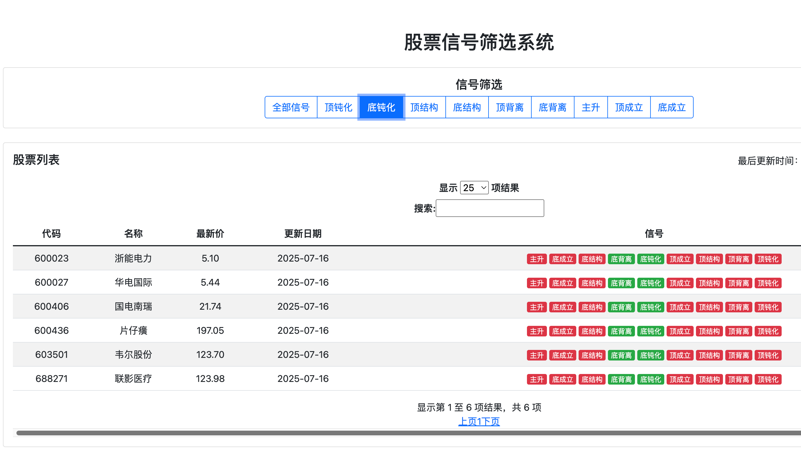

# stock-picking
small algorithm developed by km chen for picking stocks

## Usage
suitable for all operation systems(windows/linux/macos)
1. conda create -n your_env python=3.9
2. pip install -r requirements.txt
3. python app.py

## Screenshot:

